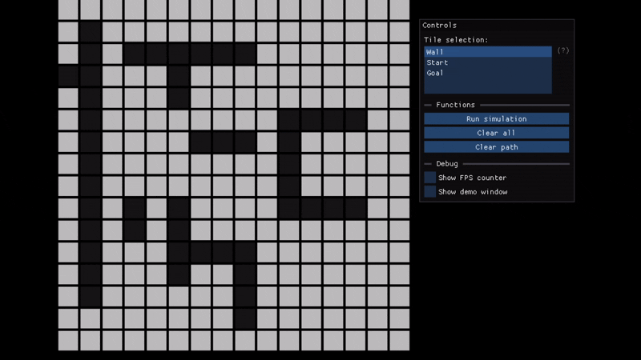

# Cpp-pathfinder

A simple C++ application implementing the A* pathfinding algorithm with visualization of the computed path on a tile-based map.  
The map can be modified at runtime, and available tools and options are accessible through the UI.

## Demo

## Technologies
- UI - [ImGui](https://github.com/ocornut/imgui)
- Graphics rendering - [SDL3](https://github.com/libsdl-org/SDL)

## Build and Run

1. `mkdir build && cd build`
2. `cmake -S .. -B . -G Ninja` (or with another generator instead of Ninja)
3. Build the project: `cmake --build .`

Run the application **from the root directory of the project** with:

`./build/visualizer`

## Author
Jakub Dudziński (jdudzinski101@gmail.com)
